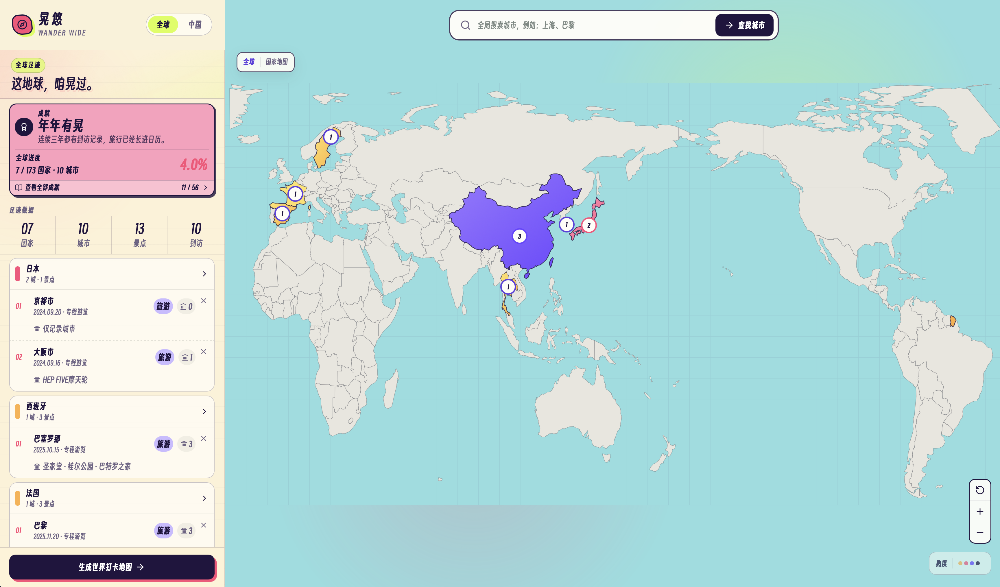
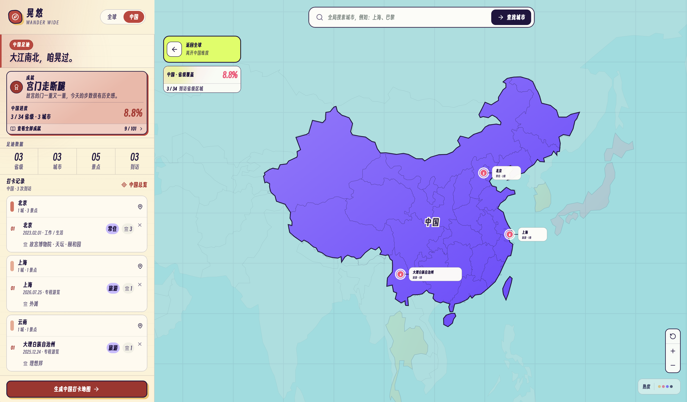
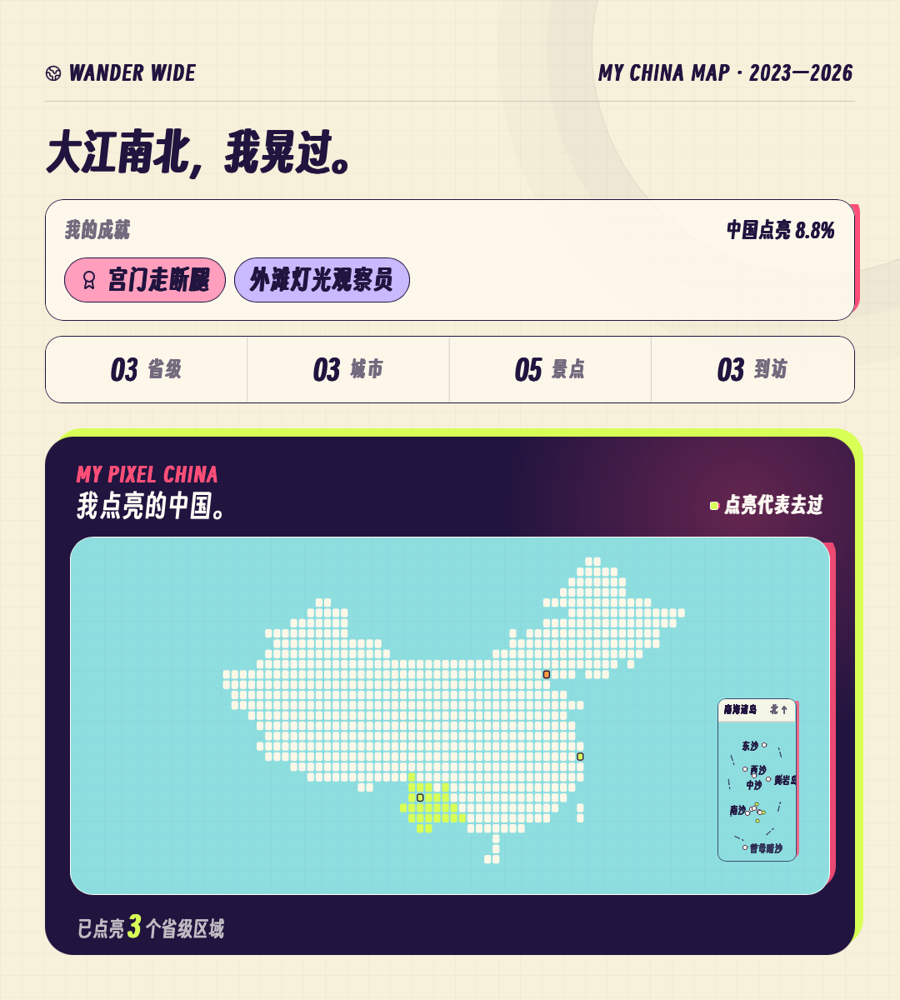

# 晃悠 · Wander Wide

中文 | [English](README_EN.md)

无需登录的个人旅行足迹工具。把去过的国家、城市和景点留在一张可探索、可统计、可生成海报的地图上。

## 产品介绍

Wonder Wide 是一张属于自己的旅行足迹地图：从全球足迹切换到中国足迹，记录去过的城市与景点，查看覆盖率和旅行称号，最后生成可以保存和分享的打卡海报。

- 在全球地图上搜索并记录国家、城市与景点。
- 在全球 / 中国两个独立维度查看足迹、覆盖率和旅行称号。
- 可选填写到访日期和出游性质；未填写日期也可以保存。
- 按到访城市数量与旅行方式生成国家熟度热力图。
- 生成世界打卡地图或中国打卡地图，并保存为图片。
- 数据默认保存在当前浏览器中，无需注册或登录。

### 产品预览

<table>
  <tr>
    <td width="25%"></td>
    <td width="25%"></td>
    <td width="25%"></td>
    <td width="25%"></td>
  </tr>
  <tr>
    <td align="center">全球足迹</td>
    <td align="center">中国足迹</td>
    <td align="center">世界打卡海报</td>
    <td align="center">中国打卡海报</td>
  </tr>
</table>

## 如何使用

> 最简单的方式是把网站地址或 GitHub 地址交给支持网页与 Sites 的 Agent。你不需要安装环境，也不需要理解部署命令。

### 方式一：直接使用现有网站（推荐）

把下面这段话发给 Agent：

```text
请打开 Wonder Wide，帮我开始记录旅行足迹：
https://yuanji-footprint-atlas.wan7ran.chatgpt.site
```

Agent 会直接打开当前网站，不需要重新部署。

### 方式二：部署自己的副本

如果你希望拥有独立的网站地址，把下面这段话发给 Agent：

```text
请从这个 GitHub 仓库为我部署一份独立的 Wonder Wide。
使用 Codex Sites，首次部署时创建新的 Site，默认保持私有，不要复用仓库作者的项目绑定：
https://github.com/Raymond711xl/wonder-wide
```

Agent 会完成获取代码、检查、创建独立 Site 和发布，并把最终地址返回给你。用户不需要手动运行任何命令。

| 你的需求 | 交给 Agent 的地址 |
| --- | --- |
| 立即使用，不关心独立地址 | [现有网站](https://yuanji-footprint-atlas.wan7ran.chatgpt.site) |
| 拥有自己的独立副本 | [GitHub 仓库](https://github.com/Raymond711xl/wonder-wide) |

需要分享给朋友时，现有网站可以直接发送同一个地址；独立副本默认私有，再让 Agent 按你的要求调整访问范围即可。

无论选择哪一种，足迹都保存在打开网站的那个浏览器中。更换浏览器、设备、Agent 或独立副本时，数据不会自动同步。

## 数据与隐私

- 旅行记录、称号选择与界面状态保存在浏览器 `localStorage`。
- 项目目前不会把个人足迹上传到自己的服务器。
- 城市和景点查询会向 Nominatim / Overpass 发送搜索词与地图范围。
- 清除浏览器站点数据会同时清除本机保存的足迹；当前版本不包含云同步。

<details>
<summary>开发与技术资料</summary>

### 本地开发

维护者需要 Node.js `>=22.13.0`。

```bash
npm ci
npm run dev
```

验证生产构建：

```bash
npm run build
npm run start
```

基础地图与行政边界随项目一同提供。城市搜索和景点推荐使用 OpenStreetMap 的 Nominatim 与 Overpass 服务，因此这两项功能需要联网。

### 地图架构

- 本地 GeoJSON 只在启动时投影一次，不加载远程地图瓦片。
- 全球地图从大西洋切开，以欧洲 → 亚洲 / 中国 → 美洲的顺序展开。
- 国家轮廓、城市节点、序号与标签共享同一个 SVG 坐标系。
- 缩放只改变 SVG `viewBox`，城市锚点不会与地图漂移。
- 地图支持空白处双击逐级放大、拖拽平移，以及触控板双指平移 / 捏合缩放。
- 世界层国家节点默认紧凑显示；国家层会常显国家名与城市名，并用碰撞避让及引导线减少重叠。
- 世界层显示国家热度与国家摘要；点击国家进入城市层。
- 未到访国家统一使用暖灰底色，已到访国家按城市数与到访性质显示四级热度。
- 国家熟度图例默认收起，悬停或键盘聚焦后展开四档含义。
- 左上角覆盖率会随全球 / 国家视图切换；城市分母采用 GeoNames `cities15000` 口径。
- 中国与西班牙国家视图使用本地 geoBoundaries 行政边界，不依赖运行时远程请求。
- 城市层的已记录节点只做展示，不再触发没有内容的二次放大。
- 选择任意城市时会自动补充最多 12 个景点推荐，并保留手动搜索作为兜底。
- 出游性质使用六级内部权重驱动国家热度，但不向用户展示分值。
- 页面顶部提供全球 / 中国两个独立维度；中国维度按 34 个省级区域统计，仅展示中国记录与中国成就，全球维度保持完整世界数据。
- 生成入口继承当前维度，分别生成世界打卡地图或中国打卡地图；两种视图共享同一份到访记录，切换时不会丢失数据。
- 中国成就按版图、区域、城市热梗、景点收藏和旅行玩法分类；城市与景点成就来自公开旅行趋势的原创转化。
- 全球与中国分别保存主成就和海报成就组合；主成就固定展示，并可再多选，单张地图最多展示 3 枚。
- 到访日期完全可选；新增城市时不再默认当天，未填写的记录不会显示日期。
- 台湾轮廓与城市记录统一归入中国。
- 记录暂存于浏览器 `localStorage`，无需登录。

### 地图数据

- 城市统计：GeoNames `cities15000`，CC BY 4.0。
- 国家内部边界：geoBoundaries `gbOpen`，CC BY 4.0；中国为 34 个 ADM1 省级区域，西班牙为 52 个 ADM2 省级行政区。
- 世界国家轮廓与首都数据：Natural Earth，公有领域。
- 在线城市与景点查询：OpenStreetMap Nominatim / Overpass；使用时请遵守相应服务政策与 OpenStreetMap 署名要求。
- 运行 `node scripts/normalize-map-data.mjs /path/to/cities15000.txt` 可重新压缩边界并生成城市统计。

### 项目结构

| 路径 | 用途 |
| --- | --- |
| `app/AtlasExplorer.tsx` | 足迹录入、搜索与地图交互 |
| `app/StaticAtlasMap.tsx` | 全球 / 国家 SVG 地图渲染 |
| `app/WanderAlmanac.tsx` | 世界 / 中国成品地图与图片导出 |
| `app/roaming-titles.ts` | 全球与中国旅行称号规则 |
| `public/data/` | 本地地图、行政区与城市统计数据 |
| `tests/` | 构建产物和关键交互的回归测试 |
| `AGENTS.md` | Agent 使用、验证和独立部署约定 |

### 验证

```bash
npm run lint
npm test
```

</details>

## 开源协议状态

项目尚未选择开源协议。当前可供查看、体验，以及经作者许可后部署个人副本；如果希望允许任何人自由复制、修改和重新发布，还需要加入明确的开源协议。个人项目通常可以优先考虑 MIT License。
